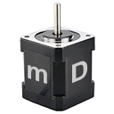

# XILab



Standa 8SMC5 motor controller software.

Description and documentation [here](https://doc.xisupport.com/en/8smc5-usb/8SMCn-USB/XILab_application_Users_guide.html).

## How to deploy a XiLab project on a Windows computer

:warning: *For Windows 10 and above, XILab can only be build with administrator rights.*

- Clone [**XiLab** repository](https://github.com/EPC-MSU/XILab) to `C:\projects\XILab` or download a repository archive and unpack it to `C:\projects\XILab`.
  
  ```batch
  :: Cloning XILab
  cd C:\projects
  git clone https://github.com/EPC-MSU/XILab
  ```

- Install dependencies.
  
  - Clone  [**XILab-dependencies** repository](https://github.com/EPC-MSU/XILab-dependencies).
    
    ```batch
    :: Cloning XILab-dependencies
    cd C:\projects\
    git clone https://github.com/EPC-MSU/XILab-dependencies
    ```
  
  - Move **Qwt** folder from the repository  on the `C:\` drive.
    
    ```batch
    move C:\projects\XILab-dependencies\Qwt C:\
    ```
  
  - Unpack `C:\Qwt\msvc2013.7z` to `C:\Qwt\`.
  
  - To run XiLab, you also need some system libraries. For this purpose, you can install **vcredist_xXX_2013.exe**  version 12.0.30501, which can be found in `C:\projects\XILab-dependencies\` or downloaded from [the link](https://www.microsoft.com/en-us/download/details.aspx?id=40784). 
    
     :bookmark_tabs: If you don't want to install the entire package, you can copy the necessary files from the `C:\projects\XILab-dependencies\WinXX` folders to the assembly directory.  Files `msvcm90.dll`, `msvcp90.dll`, `msvcr90.dll` have a product version 9.00.30729.6161. Files `msvcp120.dll`, `msvcr120.dll` have a product version 12.00.21005.1.
  
  - Download the Qt 4.8.6. Qt no longer supports version 4.8.6, but a saved copy can be downloaded from our [server](https://files.xisupport.com/XiLab_dependencies/Qt/msvc2013.7z) as an archive.
  
  - Unpack the archive to `C:\Qt\`.
  
  - Set the appropriate environment variables QTDIR and QWTDIR.
    
    ```batch
    :: Alternatively you can set these variables via "Edit environment variables for your account"
    :: command which can be found in Start menu or Windows Settings
    setx QTDIR C:\Qt\msvc2013\4.8.6
    setx QWTDIR C:\Qwt\msvc2013\qwt-6.0.0
    ```
  
  - Add to **Path** 
    
    ```batch
    :: Alternatively you can update PATH via "Edit environment variables for your account"
    :: command which can be found in Start menu or Windows Settings
    setx PATH %PATH%;C:\Qwt\msvc2013\qwt-6.0.0\lib32;C:\Qwt\msvc2013\qwt-6.0.0\lib64;C:\Qt\msvc2013\4.8.6\bin;C:\Qt\msvc2013\4.8.6_x64\bin
    ```
  
  - To create a distribution, you need to install **NSIS**. To do this, install the NSIS package using an executable located in `C:\project\XILab-dependencies\NSIS\`.
  
  - You must specify the path of the file location **makensis.exe** in PATH.
  
  :bookmark_tabs: After setting new environmental variables ypu need to restart `cmd` session.

## Build a release using a build script

To build releases for Windows, you can use the `C:\projects\XILab\build.bat` script.

- Run the script with parameter:
  
  ```batch
  build.bat local
  :: If the build is not successful for all platforms then run the full build command "build git add_service_build".
  ```

Portable software packages for different bit sizes after the build are located in the folder `C:\projects\XILab\dist_dir`.
 The installer after the build is located in the folder `C:\projects\XILab`.

:bookmark_tabs: Building **XiLab** is also possible under **linux** and **Mac**.

## Building a release using a Microsoft Visual Studio 2013

To build releases for Windows (and also to debug), you can use the  Microsoft Visual Studio.

* Preparations:
  - Find required libximc version in `C:\projects\XILab\VERSIONS` (look for `XIMC_VER`)
  - Download an archive with that version from [doc.xisupport.com](doc.xisupport.com).
  - The archive contains a folder `ximc-*.*.*`. Unpack this folder to `C:\projects\`. As a result you will get `C:\projects\ximc-*.*.*`.
  - Rename folder `ximc-*.*.*` to `libximc-win`.
  - Copy ximc.h to win32 and win64 folders:
    
    ```batch
    cd C:\projects\libximc-win\ximc
    copy ximc.h win32
    copy ximc.h win64
    ```
* Building:
  - Open `C:\projects\XILab\XILab.sln` file in Microsoft Visual Studio.
  - In the `BUILD>Configuration Manager...` menu, select the build type and platform.
  - Run builing in `BUILD>Build Solution`.

Portable software packages for different bit sizes after the build are located in the folder `C:\projects\XILab\dist_dir`.

## Editing and debugging

For editing and debugging you need to install development software such as **MSVC2013** and **QtCreator**.

* In **QtCreator**, it is convenient to perform visual editing of Windows.

* In **MSVC2013**, you can edit and debug code, as well as build it.